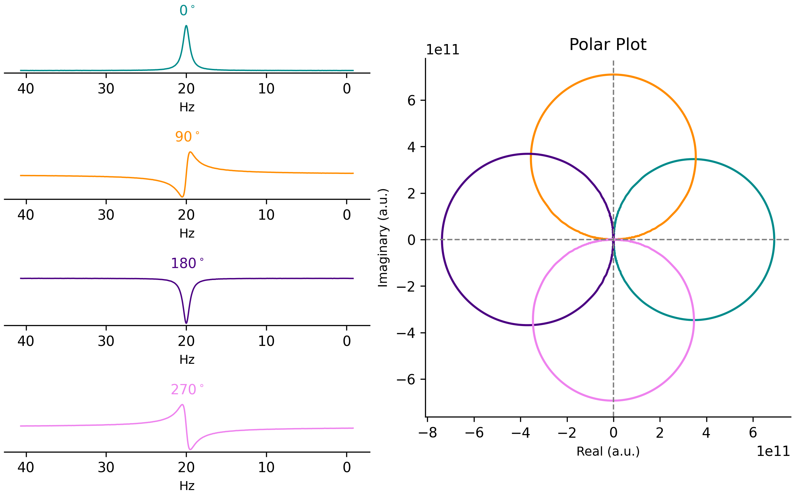

# dispatools
Python package for analyzing electrophoretic NMR data using the DISPA framework


Example: 

Create a side-by-side plot showing the 1D spectra and matched 2D DISPA polar plots.

```python
from dispatools import overlay_plot

# Load the dataset and metadata
dic,data = load_pdata("../example_data/Shoulder/4000/pdata/1")

# Plot the side-by-side 1D vs DISPA polar comparison
polar_plot(data=data, filename="test1", color="black", frame=False)

```

```

```

Jupyter notebooks containing additional examples of plotting and data analysis can be found [here.](https://github.com/lcwheeler/dispatools/tree/main/notebooks)


## Install

Clone this repository and install a development version using `pip`:
```
pip install -e .
```
